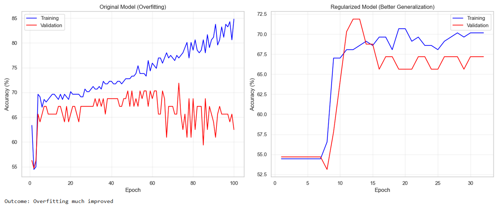

# IPO Market Gains

In this project, we will build a deep learning model that predicts whether or not a business in the Indian Market will have positive listing gains. Our goal is to exemplify some of the very useful tasks PyTorch and deep learning models can do for us and to demonstrate the different tools we can use to help our model be more accurate. We will be using a dataset based on [moneycontrol](https://www.moneycontrol.com/ipo/listed-ipos/?classic=true). It consists of details from former IPOs in the Indian market.

View this project live on Google Colab [here](https://colab.research.google.com/drive/1jz6By51XGHjZ-9FCuAk9eF21V3vnHFHI?usp=sharing)
